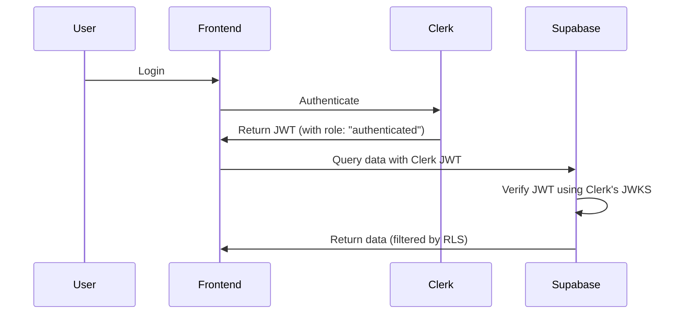

# Improved Clerk + Supabase Integration

## Better Approach: Native Third-Party Auth

Based on your research, there's a **much simpler and better** way to integrate Clerk with Supabase! Instead of using webhooks to sync users, Supabase can **directly verify Clerk JWTs** using their native third-party authentication feature.

## Why This Is Better

### ❌ Previous Approach (Webhooks)
- Complex setup with webhook endpoints
- Need to manually sync user data
- Requires backend to verify tokens
- Two databases to manage (Clerk for auth, Supabase for data)

### ✅ New Approach (Native Integration)
- **No webhooks required** for basic auth
- **Supabase verifies Clerk tokens directly**
- **Use Row Level Security (RLS)** with Clerk user IDs
- **Single source of truth** - Clerk for users, Supabase for data
- **Simpler architecture** - frontend talks directly to Supabase

---

## How It Works



**Key Points:**
1. **Clerk** handles authentication and issues JWTs
2. **Supabase** verifies these JWTs using Clerk's public keys (JWKS)
3. **Row Level Security** uses the `sub` claim (Clerk user ID) to filter data
4. **No backend needed** for simple CRUD operations!

---

## Setup Steps

### 1. Enable Clerk-Supabase Integration in Clerk Dashboard

1. Go to [Clerk Dashboard](https://dashboard.clerk.com)
2. Navigate to your application
3. Go to **Integrations** or **JWT Templates**
4. Find **Supabase** integration
5. Click **Enable** or **Configure**
6. Copy the **Clerk Domain** (JWKS URL)

**Important:** When you enable this integration, Clerk automatically adds:
- `role: "authenticated"` claim to JWTs (required by Supabase)
- Proper `sub` claim with Clerk user ID
- Compatible JWT format for Supabase

### 2. Add Clerk as Third-Party Auth Provider in Supabase

1. Go to [Supabase Dashboard](https://supabase.com/dashboard)
2. Select your project
3. Navigate to **Authentication** → **Providers** (or **Sign In / Up**)
4. Click **Add provider**
5. Select **Clerk** from the list
6. Paste your **Clerk Domain** from step 1
7. Click **Create connection**

**What this does:**
- Supabase fetches Clerk's public keys (JWKS)
- Supabase can now verify Clerk-issued JWTs
- No shared secrets needed!

### 3. Configure Row Level Security (RLS)

Instead of storing users in Supabase, use RLS to filter data by Clerk user ID.

#### Create Helper Function (Recommended)

In Supabase SQL Editor, create this function:

```sql
-- Function to get the current Clerk user ID from JWT
CREATE OR REPLACE FUNCTION requesting_user_id()
RETURNS TEXT AS $$
  SELECT NULLIF(current_setting('request.jwt.claims', true)::json->>'sub', '')::text;
$$ LANGUAGE SQL STABLE;
```

This extracts the Clerk user ID from the JWT's `sub` claim.

#### Update Your Tables

Add a `user_id` column to tables that need user-specific data:

```sql
-- Example: Projects table
ALTER TABLE projects 
ADD COLUMN user_id TEXT;

-- Set default to current user (for new rows)
ALTER TABLE projects 
ALTER COLUMN user_id 
SET DEFAULT requesting_user_id();
```

#### Create RLS Policies

Enable RLS and create policies:

```sql
-- Enable RLS on the table
ALTER TABLE projects ENABLE ROW LEVEL SECURITY;

-- Policy: Users can only see their own projects
CREATE POLICY "Users can view own projects" 
ON projects 
FOR SELECT 
USING (user_id = requesting_user_id());

-- Policy: Users can insert projects (auto-sets user_id)
CREATE POLICY "Users can create own projects" 
ON projects 
FOR INSERT 
WITH CHECK (user_id = requesting_user_id());

-- Policy: Users can update their own projects
CREATE POLICY "Users can update own projects" 
ON projects 
FOR UPDATE 
USING (user_id = requesting_user_id());

-- Policy: Users can delete their own projects
CREATE POLICY "Users can delete own projects" 
ON projects 
FOR DELETE 
USING (user_id = requesting_user_id());
```

### 4. Update Frontend to Use Clerk Tokens with Supabase

Install the Supabase client:

```bash
npm install @supabase/supabase-js
```

Create a Supabase client that uses Clerk's session token:

```typescript
// lib/supabase-client.ts
import { createClient } from '@supabase/supabase-js';
import { useSession } from '@clerk/nextjs';

export function useSupabaseClient() {
  const { session } = useSession();
  
  const supabase = createClient(
    process.env.NEXT_PUBLIC_SUPABASE_URL!,
    process.env.NEXT_PUBLIC_SUPABASE_ANON_KEY!,
    {
      global: {
        headers: {
          Authorization: session ? `Bearer ${session.getToken({ template: 'supabase' })}` : '',
        },
      },
    }
  );
  
  return supabase;
}
```

**Important:**  Use `session.getToken({ template: 'supabase' })` to get the Supabase-compatible JWT from Clerk.

### 5. Use in Components

```typescript
'use client';

import { useSupabaseClient } from '@/lib/supabase-client';
import { useEffect, useState } from 'react';

export function ProjectsList() {
  const supabase = useSupabaseClient();
  const [projects, setProjects] = useState([]);

  useEffect(() => {
    async function fetchProjects() {
      // This automatically uses the Clerk JWT
      // RLS filters to only show current user's projects
      const { data, error } = await supabase
        .from('projects')
        .select('*')
        .order('created_at', { ascending: false });

      if (error) {
        console.error('Error:', error);
      } else {
        setProjects(data);
      }
    }

    fetchProjects();
  }, [supabase]);

  return (
    <div>
      {projects.map(project => (
        <div key={project.id}>{project.name}</div>
      ))}
    </div>
  );
}
```

---

## Simplified Database Schema

Since Clerk manages users, you **don't need a users table** in Supabase! Just reference Clerk user IDs as TEXT.

```sql
-- Projects table (simplified)
CREATE TABLE projects (
    id UUID PRIMARY KEY DEFAULT gen_random_uuid(),
    user_id TEXT NOT NULL DEFAULT requesting_user_id(), -- Clerk user ID
    name TEXT NOT NULL,
    framework TEXT NOT NULL,
    status TEXT NOT NULL CHECK (status IN ('processing', 'ready', 'failed')),
    metadata JSONB DEFAULT '{}',
    created_at TIMESTAMP WITH TIME ZONE DEFAULT NOW(),
    updated_at TIMESTAMP WITH TIME ZONE DEFAULT NOW()
);

-- Enable RLS
ALTER TABLE projects ENABLE ROW LEVEL SECURITY;

-- Create policies (as shown above)
```

---

## When to Still Use Webhooks (Optional)

You might still want webhooks for:

1. **Caching user profiles** - Store name, email, avatar in Supabase for faster queries
2. **Analytics** - Track user signups and activity
3. **Audit logs** - Record user actions
4. **Referential integrity** - If you want to join user data with other tables

**Example: Optional user profile cache**

```sql
-- Optional: Cache Clerk user profiles in Supabase
CREATE TABLE user_profiles (
    clerk_user_id TEXT PRIMARY KEY,
    email TEXT,
    name TEXT,
    avatar_url TEXT,
    created_at TIMESTAMP WITH TIME ZONE DEFAULT NOW(),
    synced_at TIMESTAMP WITH TIME ZONE DEFAULT NOW()
);

-- Foreign key to clerk user IDs
ALTER TABLE projects
ADD CONSTRAINT fk_user_profile
FOREIGN KEY (user_id) 
REFERENCES user_profiles(clerk_user_id)
ON DELETE CASCADE;
```

Then use webhooks to keep this table in sync (as we implemented before).

---

## Comparison: Old vs New Approach

| Feature | Old Approach (Webhooks) | New Approach (Native) |
|---------|------------------------|-----------------------|
| **Setup Complexity** | High (webhooks, backend) | Low (just configure providers) |
| **User Sync** | Manual via webhooks | Not needed |
| **Token Verification** | Backend verifies | Supabase verifies |
| **RLS** | Uses Supabase UUIDs | Uses Clerk user IDs (TEXT) |
| **Realtime** | Supported | Supported |
| **Storage** | Two sources of truth | Single source (Clerk) |
| **Best For** | Complex user profiles in DB | Simple auth + data access |

---

## Environment Variables

### Frontend

```env
# Clerk
NEXT_PUBLIC_CLERK_PUBLISHABLE_KEY=pk_test_...
CLERK_SECRET_KEY=sk_test_...

# Supabase
NEXT_PUBLIC_SUPABASE_URL=https://your-project.supabase.co
NEXT_PUBLIC_SUPABASE_ANON_KEY=eyJhbGciOiJIUzI1NiIsInR5cCI6IkpXVCJ9...
```

### Backend (if needed)

```env
# Only needed if you still want webhooks for profile caching
CLERK_WEBHOOK_SECRET=whsec_...
SUPABASE_SERVICE_ROLE_KEY=eyJ... # for webhook handler
```

---

## Benefits of This Approach

✅ **Simpler architecture** - No backend middleware needed for basic CRUD  
✅ **Less code** - Frontend can talk directly to Supabase  
✅ **Better performance** - No extra hop through backend  
✅ **Automatic RLS** - Supabase handles user isolation  
✅ **Real-time support** - Supabase realtime works with Clerk auth  
✅ **Clerk features** - OAuth, MFA, email verification all work  
✅ **Cost effective** - Fewer services to run

---

## Next Steps

1. **Enable Clerk-Supabase integration** in Clerk Dashboard
2. **Add Clerk as provider** in Supabase Dashboard
3. **Update RLS policies** to use `requesting_user_id()`
4. **Simplify frontend** to use Clerk tokens with Supabase client
5. **Remove webhook code** (unless you need profile caching)
6. **Test RLS** by signing in as different users

---

## Migration Path

If you already implemented the webhook approach:

1. ✅ Keep Clerk setup (already done)
2. ✅ Enable native Clerk-Supabase integration
3. 🔄 Update frontend to use Clerk tokens directly with Supabase
4. 🔄 Modify RLS policies to use Clerk user IDs
5. 🔄 Remove backend token verification middleware (optional)
6. 🔄 Keep webhooks ONLY if you want user profile caching

---

## Questions?

This new approach is **recommended by both Clerk and Supabase** as the official integration method. It's simpler, more secure, and requires less infrastructure!
